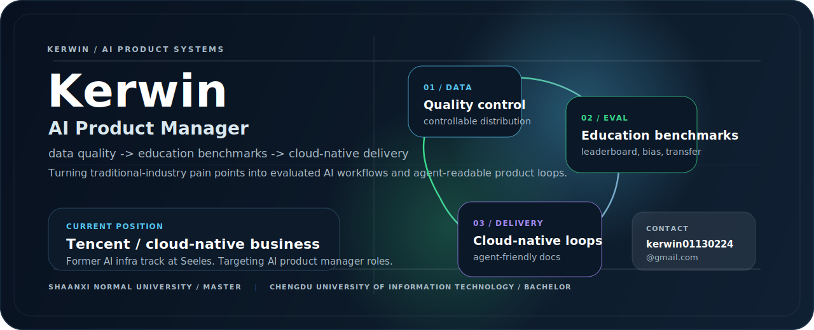

<p align="center">
  
</p>

<h1 align="center">Kerwin</h1>

<p align="center">
  <strong>AI Product Manager candidate focused on data quality, evaluation, cloud-native delivery, and agent-ready product loops.</strong>
</p>

<p align="center">
  <a href="mailto:kerwin01130224@gmail.com"></a>
  <a href="https://github.com/Kerwin0224"></a>
  
  
</p>

---

## Product Thesis

I want to build AI products that solve traditional-industry pain points in real business settings. My bias is toward **measurable loops**: scenario definition, controllable data generation, benchmark evaluation, cloud-native delivery, and feedback that improves the next iteration.

我的长期方向是：用 AI 解决传统行业的真实痛点，把能力落到具体业务、具体场景和可验证的产品闭环中。

```text
industry pain point
  -> product scenario
  -> controllable synthetic data
  -> benchmark and bias evaluation
  -> cloud-native delivery
  -> agent-friendly documentation
  -> product loop improvement
```

## Signal Map

- **Data quality** - Synthetic data should be measurable, steerable, and auditable instead of just plentiful. Proof surface: quality distribution control, retention gates, evidence ledgers.
- **Education evaluation** - AI education products need repeatable benchmarks, not isolated demos. Proof surface: leaderboard, bias analysis, held-out tutoring transfer, process evaluation.
- **AI infrastructure** - Product ideas fail if runtime, routing, observability, and recovery are vague. Proof surface: AI infra work at Seeles, Skill/MCP routing, request-runtime discipline.
- **Cloud native** - AI products need production surfaces that operations teams can trust. Proof surface: current Tencent cloud-native business, Tencent Cloud/TCCLI, and TKE tooling.
- **Agent documentation** - Docs should become executable context for people and agents. Proof surface: loop engineering, SSOT-oriented adapters, CLI-first guides.

## Experience

- **Tencent** - Cloud-native business, developer workflows, cloud operation surfaces, and automation.
- **Seeles** - AI infrastructure related business, with attention to model/application runtime reliability.
- **Research track** - Synthetic-data quality control, education benchmark design, evidence packaging, and paper-facing analysis infrastructure.

## Selected Work

- **Education benchmark and evidence infra** - Converts AI-education claims into comparable leaderboard, bias, transfer, and process-evaluation surfaces.
- **Controllable synthetic-data quality framework** - Studies how to make synthetic-data quality distributions more controllable and useful for downstream tasks.
- **Tencent Cloud TCCLI Skill** - Standardizes Tencent Cloud API operations through `tccli`, making cloud workflows more agent-operable. [Repo](https://github.com/Kerwin0224/tencentcloud-tccli-skill)
- **TKE CLI and workshop materials** - Packages cloud-native operating knowledge into repeatable guides, workshops, and CLI-first workflows. [Guide](https://github.com/Kerwin0224/tke-cli-guide) / [Workshop](https://github.com/Kerwin0224/tke-workshop.github.io)
- **cc-switch-adapter** - Routes skill and MCP operations through a centralized SSOT to prevent scattered agent-tooling state. [Repo](https://github.com/Kerwin0224/cc-switch-adapter)
- **Image2PPT** - Converts courseware screenshots into editable PPT through image layering, super-resolution, OCR, and VLM reasoning. [Repo](https://github.com/Kerwin0224/Image2PPT)
- **QA from PDFs** - Builds validated QA JSONL from paired question and answer PDFs for education datasets and benchmark construction. [Repo](https://github.com/Kerwin0224/EDUQA-from-pdfs)

## Education

- **Master's degree** - Shaanxi Normal University
- **Bachelor's degree** - Chengdu University of Information Technology

## Operating Vocabulary

<p>
  
  
  
  
  
  
  
  
  
</p>

## GitHub Snapshot

<p align="center">
  
  
</p>

## Contact

I am open to AI product roles where product judgment, AI evaluation, data infrastructure, and industry landing all matter.

- Email: [kerwin01130224@gmail.com](mailto:kerwin01130224@gmail.com)
- GitHub: [Kerwin0224](https://github.com/Kerwin0224)

<p align="center">
  <sub>Profile README maintained in <a href="https://github.com/Kerwin0224/Kerwin0224">Kerwin0224/Kerwin0224</a>.</sub>
</p>
